# Laporan Resmi Praktikum Sistem Operasi
## Modul 3 — Socket, IPC, dan Sinkronisasi

**Nama Repository:** SISOP-3-2026-IT-[NRP]

---

## Daftar Isi
- [Soal 1 — Present Day, Present Time](#soal-1--present-day-present-time)
  - [Penjelasan Soal](#penjelasan-soal-1)
  - [Struktur File](#struktur-file-soal-1)
  - [Penjelasan Kode](#penjelasan-kode-soal-1)
  - [Output](#output-soal-1)
- [Soal 2 — The Battle of Eterion](#soal-2--the-battle-of-eterion)
  - [Penjelasan Soal](#penjelasan-soal-2)
  - [Struktur File](#struktur-file-soal-2)
  - [Penjelasan Kode](#penjelasan-kode-soal-2)
  - [Output](#output-soal-2)

---

## Soal 1 — Present Day, Present Time

### Penjelasan Soal 1

Soal ini meminta pembuatan sistem komunikasi berbasis **Socket TCP** yang mensimulasikan jaringan bernama "The Wired". Sistem terdiri dari dua komponen utama:

- **`wired.c`** — Server pusat yang mengelola koneksi dari banyak client secara bersamaan
- **`navi.c`** — Client (NAVI) yang terhubung ke server dan dapat mengirim/menerima pesan

Fitur yang diimplementasikan:
1. Koneksi stabil menggunakan TCP Socket pada port yang ditentukan di `protocol.h`
2. NAVI menjalankan dua fungsi secara asinkron (tanpa fork) menggunakan thread — satu untuk mendengarkan pesan masuk, satu untuk membaca input keyboard
3. Server skalabel menggunakan `select()`/thread per client untuk mendeteksi koneksi baru dan pesan masuk
4. Registrasi identitas unik — server menolak nama yang sudah terdaftar
5. Broadcast pesan ke semua client aktif
6. Remote Procedure Call (RPC) untuk admin "The Knights" dengan autentikasi password
7. Logging semua aktivitas ke `history.log` dengan format timestamp

---

### Struktur File Soal 1

```
soal1/
├── navi.c       # Client (NAVI)
├── protocol.h   # Header: definisi struct, konstanta, enum
└── wired.c      # Server (The Wired)
```

---

### Penjelasan Kode Soal 1

#### `protocol.h` — Protokol Komunikasi

File ini menjadi "perjanjian bersama" antara server dan client. Berisi definisi konstanta, enum tipe pesan, dan struct `Message` yang digunakan untuk komunikasi lewat socket.

```c
#ifndef PROTOCOL_H
#define PROTOCOL_H

#define PORT 8080
#define MAX_CLIENTS 100
#define BUFFER_SIZE 1024
#define NAME_SIZE 64
#define LOG_FILE "history.log"
#define ADMIN_NAME "The Knights"
#define ADMIN_PASSWORD "protocol7"

typedef enum {
    MSG_REGISTER,
    MSG_CHAT,
    MSG_EXIT,
    MSG_RPC
} MessageType;

typedef enum {
    RPC_GET_USERS,
    RPC_GET_UPTIME,
    RPC_SHUTDOWN
} RPCCommand;

typedef struct {
    MessageType type;
    char sender[NAME_SIZE];
    char content[BUFFER_SIZE];
    RPCCommand rpc_cmd;
} Message;

typedef struct {
    int fd;
    char name[NAME_SIZE];
    int active;
} Client;

#endif
```

**Penjelasan:** `MessageType` mendefinisikan jenis pesan yang bisa dikirim. `Message` adalah struct yang selalu dikirim melalui socket — baik dari client ke server maupun sebaliknya. `Client` menyimpan informasi setiap client yang terhubung.

---

#### `wired.c` — Server

**Setup Socket:**

```c
server_fd = socket(AF_INET, SOCK_STREAM, 0);
setsockopt(server_fd, SOL_SOCKET, SO_REUSEADDR, &opt, sizeof(opt));
address.sin_family = AF_INET;
address.sin_addr.s_addr = INADDR_ANY;
address.sin_port = htons(PORT);
bind(server_fd, (struct sockaddr*)&address, sizeof(address));
listen(server_fd, 10);
```

Server membuat socket TCP, men-bind ke port yang ditentukan, lalu mulai mendengarkan koneksi masuk. `SO_REUSEADDR` memungkinkan port langsung dipakai ulang setelah server restart.

**Thread per Client:**

```c
int *fd_ptr = malloc(sizeof(int));
*fd_ptr = client_fd;
pthread_t tid;
pthread_create(&tid, NULL, handle_client, fd_ptr);
pthread_detach(tid);
```

Setiap client yang konek akan ditangani oleh thread tersendiri. `pthread_detach` digunakan agar main thread tidak perlu menunggu thread selesai (`pthread_join`), sehingga server bisa terus menerima client baru.

**Mutex untuk Proteksi Data:**

```c
pthread_mutex_t clients_lock = PTHREAD_MUTEX_INITIALIZER;

// Saat mengakses array clients[]:
pthread_mutex_lock(&clients_lock);
// ... akses data ...
pthread_mutex_unlock(&clients_lock);
```

Mutex mencegah race condition saat beberapa thread mengakses array `clients[]` secara bersamaan.

**Fungsi Broadcast:**

```c
void broadcast(Message *msg, int sender_fd) {
    pthread_mutex_lock(&clients_lock);
    for (int i = 0; i < MAX_CLIENTS; i++) {
        if (clients[i].active && clients[i].fd != sender_fd) {
            send(clients[i].fd, msg, sizeof(Message), 0);
        }
    }
    pthread_mutex_unlock(&clients_lock);
}
```

Meneruskan pesan dari satu client ke semua client lain yang aktif.

**Fungsi Logging:**

```c
void write_log(const char *category, const char *message) {
    pthread_mutex_lock(&clients_lock);
    FILE *f = fopen(LOG_FILE, "a");
    time_t now = time(NULL);
    struct tm *t = localtime(&now);
    char timestamp[32];
    strftime(timestamp, sizeof(timestamp), "%Y-%m-%d %H:%M:%S", t);
    fprintf(f, "[%s] [%s] [%s]\n", timestamp, category, message);
    fclose(f);
    pthread_mutex_unlock(&clients_lock);
}
```

Menulis log ke `history.log` dengan format `[YYYY-MM-DD HH:MM:SS] [Kategori] [Pesan]`. Mutex digunakan agar dua thread tidak menulis ke file secara bersamaan yang bisa menyebabkan data korup.

**Handler RPC (Admin):**

```c
void handle_rpc(int client_fd, RPCCommand cmd, const char *sender) {
    switch (cmd) {
        case RPC_GET_USERS:
            // Hitung jumlah user aktif (admin tidak dihitung)
            break;
        case RPC_GET_UPTIME:
            // Hitung selisih waktu sekarang dengan server_start
            break;
        case RPC_SHUTDOWN:
            // Broadcast shutdown, tutup server
            break;
    }
}
```

Admin "The Knights" dapat mengakses fitur khusus melalui jalur RPC yang terpisah dari jalur broadcast chat biasa.

---

#### `navi.c` — Client

**Dua Thread untuk Async I/O:**

```c
// Thread receiver — mendengarkan pesan dari server
void *receive_handler(void *arg) {
    Message msg;
    while (recv(sock_fd, &msg, sizeof(msg), 0) > 0) {
        pthread_mutex_lock(&print_lock);
        printf("\r\033[K");
        printf("%s\n", msg.content);
        printf("> %s", input_buffer);
        fflush(stdout);
        pthread_mutex_unlock(&print_lock);
    }
    exit(0);
    return NULL;
}

// Main thread — membaca input keyboard
pthread_create(&recv_thread, NULL, receive_handler, NULL);
pthread_detach(recv_thread);
```

Dua thread berjalan paralel: satu mendengarkan pesan masuk dari server, satu lagi membaca input keyboard dari user.

**Raw Mode Terminal:**

```c
void enable_raw_mode() {
    tcgetattr(STDIN_FILENO, &orig_termios);
    struct termios raw = orig_termios;
    raw.c_lflag &= ~(ECHO | ICANON);
    tcsetattr(STDIN_FILENO, TCSAFLUSH, &raw);
}
```

Raw mode memungkinkan pembacaan karakter per karakter langsung dari keyboard tanpa buffering kernel. Ini penting agar input yang sedang diketik user bisa ditampilkan ulang (`input_buffer`) ketika ada pesan masuk dari user lain, sehingga tampilan terminal tidak berantakan.

---

### Output Soal 1

#### Server Online
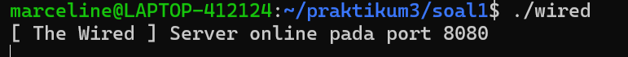

#### Nama Duplikat Ditolak
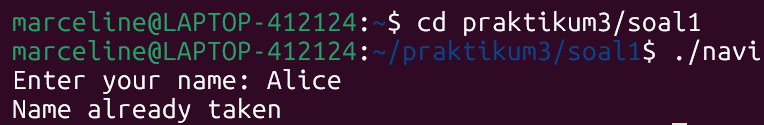

#### Broadcast Chat
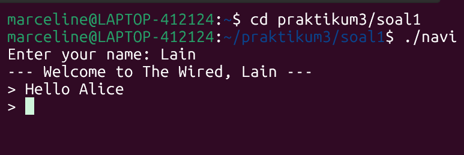
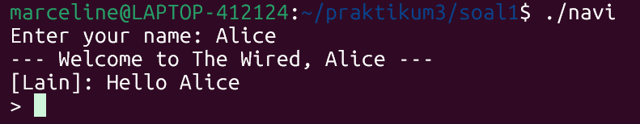

#### Admin Console (The Knights)
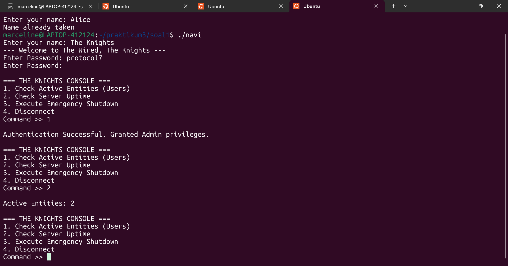

#### History Log
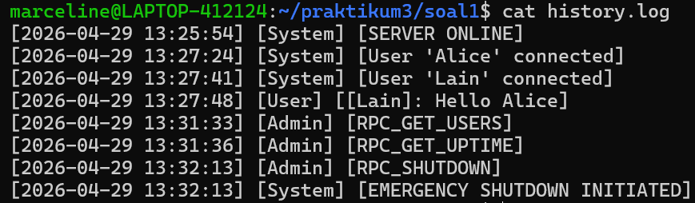

---

## Soal 2 — The Battle of Eterion

### Penjelasan Soal 2

Soal ini meminta pembuatan sistem game battle arena berbasis **IPC (Inter-Process Communication)**. Berbeda dengan Soal 1 yang menggunakan Socket (bisa antar komputer), Soal 2 menggunakan IPC yang bekerja dalam satu mesin menggunakan memori bersama.

Sistem terdiri dari:

- **`orion.c`** — Server yang berperan sebagai "penjaga arena", mengelola semua data dan logika game
- **`eternal.c`** — Client yang berperan sebagai "prajurit" yang masuk ke arena

Tiga mekanisme IPC yang digunakan:
1. **Shared Memory** — Menyimpan data seluruh pemain, status battle, dan history
2. **Message Queue** — Komunikasi request/reply antara eternal dan orion
3. **Semaphore** — Mencegah race condition saat akses Shared Memory

Fitur yang diimplementasikan:
1. Setup IPC (Shared Memory, Message Queue, Semaphore)
2. Main menu dengan ASCII art
3. Register & Login dengan data persistent di Shared Memory
4. Matchmaking selama 35 detik, jika tidak ada lawan maka lawan bot
5. Battle realtime — tekan `a` untuk attack, `u` untuk ultimate
6. Cooldown 1 detik per serangan
7. Armory — beli senjata dengan gold
8. Match history per pemain
9. Cleanup IPC otomatis saat server shutdown

---

### Struktur File Soal 2

```
soal2/
├── arena.h      # Header: definisi struct, IPC keys, konstanta game
├── eternal.c    # Client (prajurit)
├── orion.c      # Server (penjaga arena)
└── Makefile     # Build system
```

---

### Penjelasan Kode Soal 2

#### `arena.h` — Definisi Bersama

```c
// IPC Keys
#define SHM_KEY   0x00001234
#define MSG_KEY   0x00005678
#define SEM_KEY   0x00009012

// Konstanta game
#define MAX_PLAYERS         10
#define BASE_DAMAGE         10
#define BASE_HEALTH         100
#define MATCHMAKING_TIMEOUT 35

// Struct data pemain
typedef struct {
    char username[64];
    char password[64];
    int  gold;
    int  level;
    int  xp;
    int  weapon_bonus_dmg;
    char weapon_name[32];
    int  logged_in;
    int  in_battle;
} Player;

// Struct arena (isi Shared Memory)
typedef struct {
    Player     players[MAX_PLAYERS];
    int        player_count;
    QueueEntry queue[MAX_PLAYERS];
    int        queue_size;
    struct {
        char player1[64];
        char player2[64];
        int  hp1, hp2;
        int  active;
    } battles[MAX_PLAYERS/2];
    BattleRecord history[MAX_PLAYERS][20];
    int          history_count[MAX_PLAYERS];
} Arena;

// Message Queue
typedef struct {
    long mtype;
    char mtext[256];
} MsgBuf;
```

**Penjelasan:** Tiga key IPC yang berbeda digunakan agar sistem tidak tabrakan saat mengakses resource yang berbeda. `Arena` adalah struct yang disimpan di Shared Memory dan bisa diakses langsung oleh `orion` maupun `eternal`. `MsgBuf` digunakan untuk komunikasi request/reply melalui Message Queue.

---

#### `orion.c` — Server Arena

**Setup IPC:**

```c
void setup_ipc() {
    // Buat Shared Memory
    shm_id = shmget(SHM_KEY, sizeof(Arena), IPC_CREAT | 0666);
    arena  = (Arena*)shmat(shm_id, NULL, 0);
    memset(arena, 0, sizeof(Arena));

    // Buat Message Queue
    msg_id = msgget(MSG_KEY, IPC_CREAT | 0666);

    // Buat Semaphore, set nilai awal = 1 (unlocked)
    sem_id = semget(SEM_KEY, 1, IPC_CREAT | 0666);
    semctl(sem_id, 0, SETVAL, 1);

    printf("Orion is ready (PID: %d)\n", getpid());
}
```

Orion harus berjalan lebih dulu karena dia yang membuat (`IPC_CREAT`) semua resource IPC. Eternal hanya melakukan attach ke resource yang sudah ada.

**Semaphore sebagai Pengganti Mutex:**

```c
void sem_lock() {
    struct sembuf op = {0, -1, 0}; // kurangi 1 → lock
    semop(sem_id, &op, 1);
}

void sem_unlock() {
    struct sembuf op = {0, 1, 0};  // tambah 1 → unlock
    semop(sem_id, &op, 1);
}
```

Semaphore digunakan sebagai pengganti `pthread_mutex` karena mutex hanya bekerja dalam satu process, sedangkan di sini `orion` dan `eternal` adalah process yang berbeda.

**Format Komunikasi Message Queue:**

```
eternal → orion : mtype = 1
    "REGISTER:username:password:PID"
    "LOGIN:username:password:PID"
    "BATTLE:username:x:PID"
    "ATTACK:username:slot:damage:PID"
    "BUY:username:weapon_idx:PID"
    "LOGOUT:username:x:PID"
    "CANCEL:username:x:PID"
    "HISTORY:username:opponent:result:xp:PID"

orion → eternal : mtype = PID_eternal
    "OK:..."
    "FAIL:..."
    "WAIT:Searching..."
    "BATTLE_START:opponent:slot:hp1:hp2"
```

PID digunakan sebagai `mtype` balasan agar setiap client hanya menerima balasan yang ditujukan untuknya.

**Handler Matchmaking:**

```c
void handle_battle_request(char *username, long client_pid) {
    // Cek apakah ada player lain di queue
    if (opponent_idx != -1) {
        // Ada lawan — setup battle slot, notify kedua player
        snprintf(reply.mtext, ..., "BATTLE_START:...");
        msgsnd(msg_id, &reply, ...);        // notify requester
        
        MsgBuf notify;
        notify.mtype = opponent_pid;         // PID lawan
        snprintf(notify.mtext, ..., "BATTLE_START:...");
        msgsnd(msg_id, &notify, ...);       // notify lawan di queue
    } else {
        // Tidak ada lawan — masuk queue, beritahu WAIT
        arena->queue[arena->queue_size].pid = client_pid;
        snprintf(reply.mtext, ..., "WAIT:Searching...");
        msgsnd(msg_id, &reply, ...);
    }
}
```

PID lawan disimpan di `QueueEntry` agar orion bisa langsung mengirim notifikasi `BATTLE_START` ke eternal yang sedang menunggu di matchmaking loop.

---

#### `eternal.c` — Client Prajurit

**Attach ke IPC (bukan buat):**

```c
int setup_ipc() {
    shm_id = shmget(SHM_KEY, sizeof(Arena), 0666); // tanpa IPC_CREAT
    arena  = (Arena*)shmat(shm_id, NULL, 0);
    msg_id = msgget(MSG_KEY, 0666);                 // tanpa IPC_CREAT
    if (shm_id < 0 || msg_id < 0) {
        printf("Orion are you there?\n");
        return 0;
    }
    return 1;
}
```

Eternal tidak membuat IPC baru — dia hanya attach ke yang sudah dibuat orion. Jika orion belum jalan, `shmget` akan gagal dan eternal mencetak "Orion are you there?".

**Helper Komunikasi:**

```c
void send_to_orion(const char *msg_text, MsgBuf *reply) {
    MsgBuf msg;
    msg.mtype = 1;
    strncpy(msg.mtext, msg_text, sizeof(msg.mtext));
    msgsnd(msg_id, &msg, sizeof(msg.mtext), 0);
    
    // Tunggu balasan dengan mtype = PID kita
    msgrcv(msg_id, reply, sizeof(reply->mtext), my_pid, 0);
}
```

Semua request ke orion menggunakan `mtype = 1`. Balasan orion menggunakan `mtype = PID_eternal`, sehingga hanya eternal yang bersangkutan yang membaca balasannya.

**Battle Realtime dengan Raw Mode:**

```c
void do_battle(int slot, int am_player1,
               const char *username, int player_idx) {
    enable_raw_mode(); // baca karakter langsung tanpa enter

    time_t last_attack = 0;

    while (arena->battles[slot].active) {
        print_battle_screen(arena, slot, am_player1, username);

        char c = 0;
        read(STDIN_FILENO, &c, 1); // non-blocking

        if (c == 'a') {
            if (time(NULL) - last_attack >= 1) { // cooldown 1 detik
                last_attack = time(NULL);
                // Kirim ATTACK ke orion
            }
        } else if (c == 'u') {
            if (arena->players[player_idx].weapon_bonus_dmg > 0) {
                // Kirim ultimate (damage * 3) ke orion
            }
        }

        usleep(100000); // refresh tiap 0.1 detik
    }

    disable_raw_mode();
}
```

Raw mode dengan `VMIN=0` dan `VTIME=1` membuat `read()` bersifat non-blocking — jika tidak ada input dalam 0.1 detik, langsung lanjut. Ini memungkinkan layar refresh secara realtime meski player tidak menekan tombol apapun.

**Matchmaking Loop:**

```c
while (time(NULL) - start < MATCHMAKING_TIMEOUT) {
    MsgBuf check;
    // Non-blocking check untuk pesan BATTLE_START
    if (msgrcv(msg_id, &check, sizeof(check.mtext),
               my_pid, IPC_NOWAIT) >= 0) {
        if (strncmp(check.mtext, "BATTLE_START:", 13) == 0) {
            // Parse dan mulai battle
            do_battle(slot, am_p1, username, player_idx);
            found = 1;
            break;
        }
    }
    printf("\rSearching... [%lds]  ", time(NULL) - start);
    fflush(stdout);
    usleep(100000); // cek tiap 0.1 detik
}

if (!found) {
    // Timeout — lawan bot
    send_to_orion("CANCEL:...", &reply);
    do_battle_bot(username, player_idx);
}
```

Loop matchmaking menggunakan `IPC_NOWAIT` agar tidak blocking — setiap 0.1 detik cek apakah ada notifikasi `BATTLE_START` dari orion. Jika 35 detik tidak ada lawan, player melawan bot.

**Formula Stats:**

| Stat | Formula |
|------|---------|
| Damage | `BASE_DAMAGE + (total_xp / 50) + weapon_bonus_dmg` |
| Health | `BASE_HEALTH + (total_xp / 10)` |
| Ultimate | `Total Damage × 3` |
| XP (menang) | `+50` |
| XP (kalah) | `+15` |
| Gold (menang) | `+120` |
| Gold (kalah) | `+30` |
| Level up | Setiap kelipatan 100 XP |

---

### Output Soal 2

#### Orion Ready
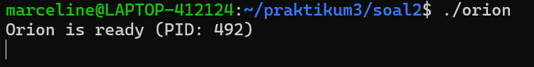

#### Eternal — Orion Tidak Jalan


#### Menu Utama (Register/Login)
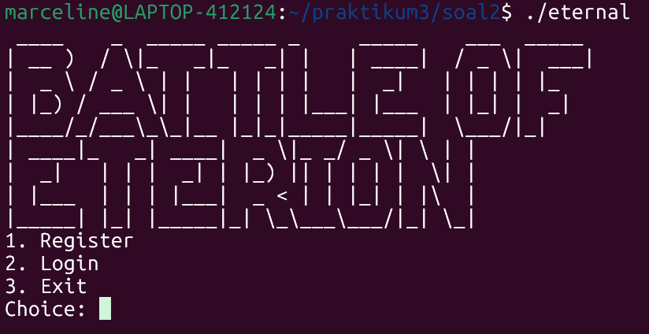

#### Register Akun Baru
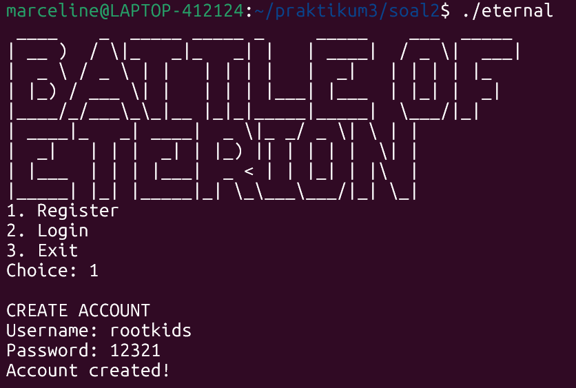

#### Login & Profile
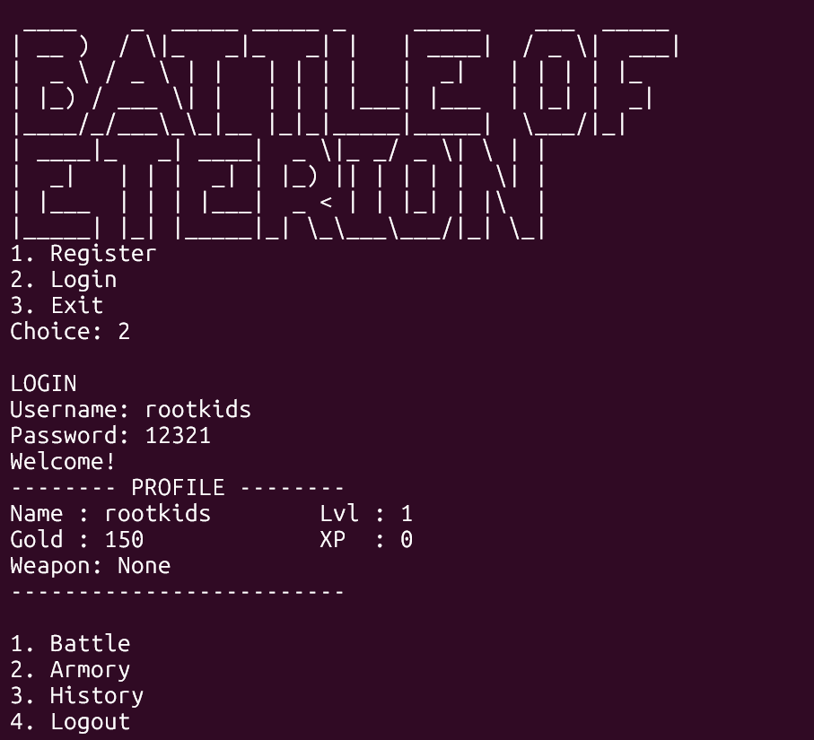

#### Matchmaking
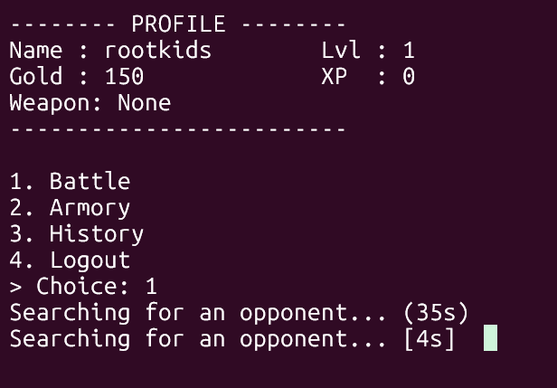

#### Battle Arena (PvP)
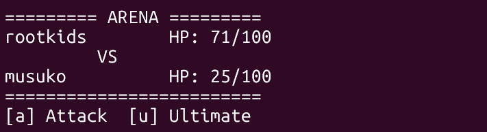

#### Battle Arena (vs Bot)
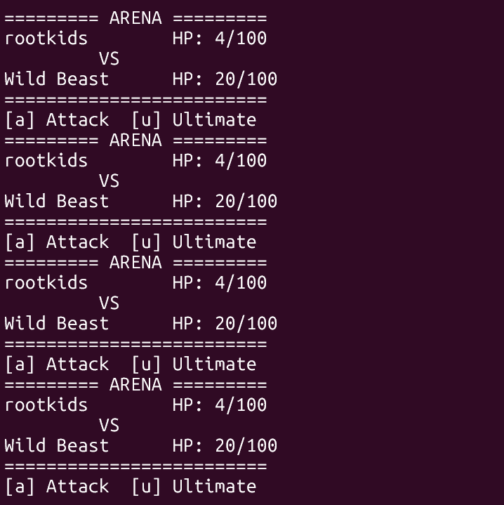

#### Victory & Defeat

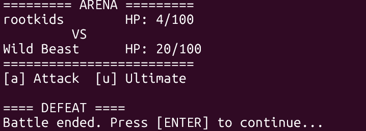

#### Armory
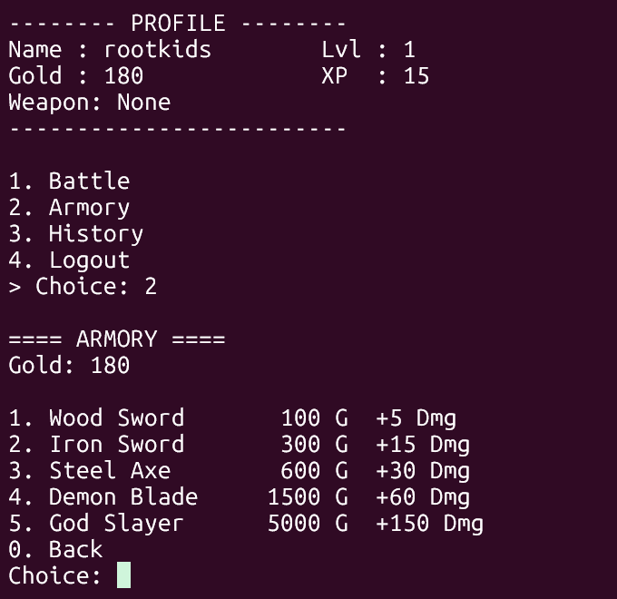

#### Match History
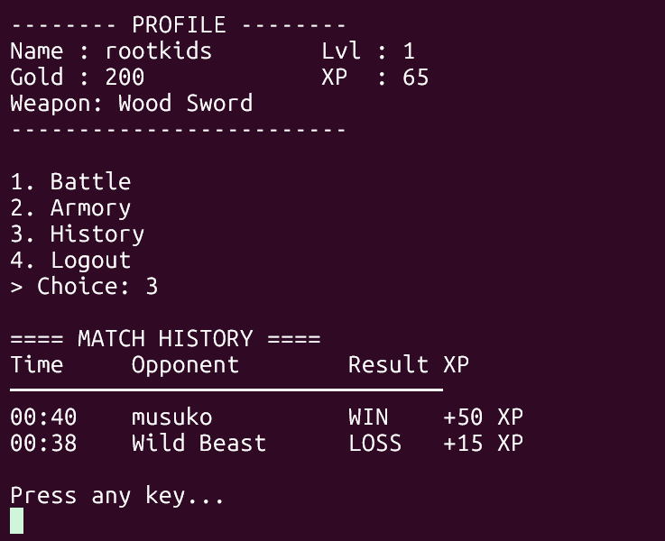

---

## Kendala dan Solusi

| No | Kendala | Solusi |
|----|---------|--------|
| 1 | Input user hilang saat pesan masuk di chat | Implementasi raw mode terminal + `input_buffer` global |
| 2 | Race condition saat banyak thread akses `clients[]` | Tambah `pthread_mutex_lock` di semua akses array |
| 3 | IPC tidak terhapus saat orion di-Ctrl+C | Tangkap `SIGINT`/`SIGTERM` dengan `signal()`, panggil `cleanup_ipc()` |
| 4 | Format pesan `"::"` menyebabkan PID gagal di-parse | Ganti `"::"` dengan `":x:"` sebagai dummy argument |
| 5 | Player tidak bisa battle kedua kali | Reset flag `in_battle` di `do_battle()` dan cek battle slot aktif sebelum request |
| 6 | Matchmaking stuck di detik terakhir | Ganti `sleep(1)` dengan `usleep(100000)` untuk cek lebih sering |
| 7 | History tidak tersimpan | Panggil `save_history()` di `handle_attack()` setelah battle selesai |

---

## Cara Kompilasi dan Menjalankan

### Soal 1

```bash
cd soal1

# Compile
gcc wired.c -o wired -pthread -Wno-format-truncation
gcc navi.c  -o navi  -pthread

# Jalankan server (Terminal 1)
./wired

# Jalankan client (Terminal 2, 3, dst)
./navi
```

### Soal 2

```bash
cd soal2

# Compile
make
# atau manual:
gcc orion.c   -o orion   -pthread -lrt
gcc eternal.c -o eternal -pthread -lrt

# Jalankan server (Terminal 1)
./orion

# Jalankan client (Terminal 2, 3, dst)
./eternal

# Bersihkan IPC jika server crash
make clear_ipc
# atau manual:
ipcs -m | grep 0x00001234 | awk '{print $2}' | xargs -r ipcrm -m
ipcs -q | grep 0x00005678 | awk '{print $2}' | xargs -r ipcrm -q
ipcs -s | grep 0x00009012 | awk '{print $2}' | xargs -r ipcrm -s
```

---

*Laporan ini dibuat sebagai bagian dari pengerjaan Praktikum Sistem Operasi 2026 — Modul 3 dengan bantuan https://claude.ai/share/49145a9e-4b9b-40bd-b74e-1bbc3ca371d7*
